# 影忆智寻 · EchoAlbum

<p align="center">
  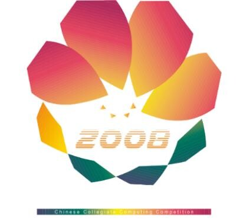
</p>

<h1 align="center">基于多模态检索模型的智能相册</h1>

<p align="center">
  <strong>用一句自然语言，在自己的相册里找到想找的照片。</strong><br />
  大创项目工程成果之一｜参加第 18 届中国大学生计算机设计大赛（4C2025）
</p>

<p align="center">
  <a href="https://github.com/LT1923/4c2025"></a>
  
  
  
  
  
</p>

<p align="center">
  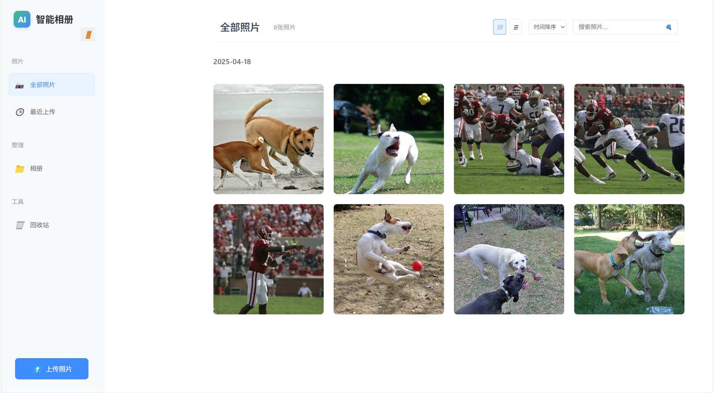
</p>

## 项目一句话

**影忆智寻**是一个面向个人相册的全栈多模态检索系统：用户输入“草地上两只奔跑的小狗”等自然语言，系统将文本编码到与图像一致的语义空间，再通过 FAISS HNSW 索引返回最相关的照片。项目同时探索了 **BGE-VL-base 轻量化、三元量化、自蒸馏和近似最近邻检索**，把模型研究落到了可交互的 Web 产品中。

这不是简单的“图片标签搜索”：它把“模型压缩—向量索引—后端接口—前端交互—数据管理”串成了完整链路，适合作为多模态检索、模型部署和全栈工程能力的项目案例。

## 为什么值得展示

| 维度 | 项目实现 | 面试可展开的问题 |
| --- | --- | --- |
| 产品问题 | 用自然语言检索个人相册，支持上传、图集、回收站和移动端布局 | 如何把研究模型做成可用产品？ |
| 多模态模型 | BGE-VL-base 图文统一编码；训练/推理阶段支持量化模型 | 图像和文本怎样落到同一语义空间？ |
| 轻量化 | 三元权重 `{−1, 0, +1}`、自蒸馏、可选 BitBLAS 替换线性层 | 压缩率、精度和速度如何权衡？ |
| 检索系统 | 每个用户维护独立 embedding、路径文件和 FAISS HNSW 索引 | 为什么不用全量暴力相似度计算？ |
| 工程落地 | Vue 3 + Flask + MySQL + 文件存储，HTTP/JSON 解耦前后端 | 如何保证索引、数据库和文件状态一致？ |

## 功能预览

### 1. 从登录到相册浏览

<table>
  <tr>
    <td width="50%"></td>
    <td width="50%"></td>
  </tr>
  <tr>
    <td align="center"><sub>登录 / 注册：账号体系与入口页</sub></td>
    <td align="center"><sub>相册主页：时间轴、网格/列表视图与上传入口</sub></td>
  </tr>
</table>

### 2. 自然语言检索与图集管理

<table>
  <tr>
    <td width="58%">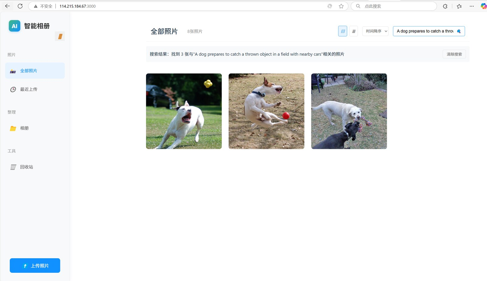</td>
    <td width="42%">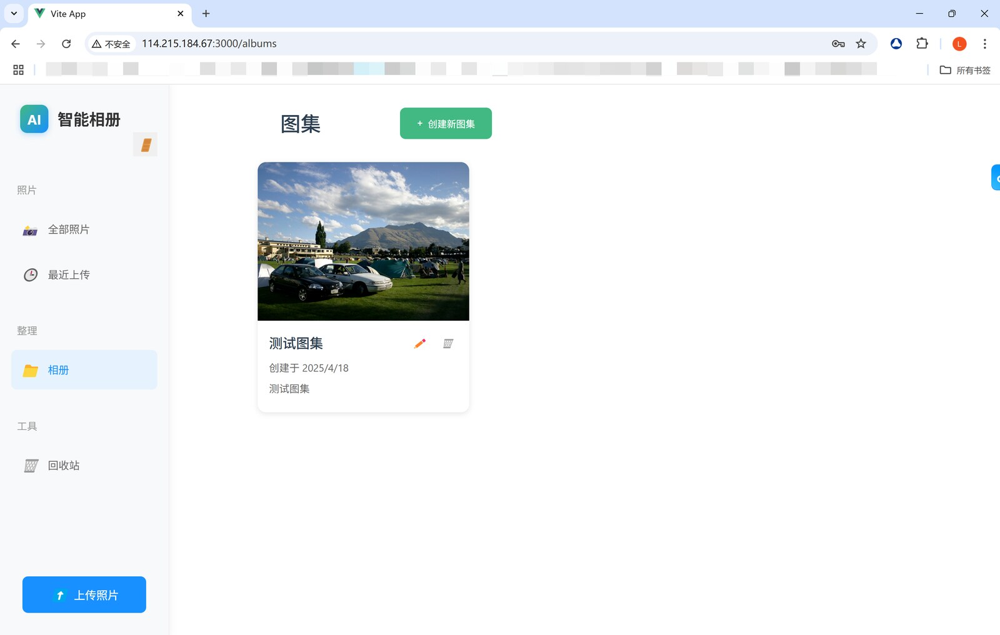</td>
  </tr>
  <tr>
    <td align="center"><sub>输入语义描述后，按相似度返回 Top-K 图片</sub></td>
    <td align="center"><sub>卡片式图集创建、编辑与删除</sub></td>
  </tr>
</table>

### 3. 细节交互：移动、回收与恢复

<table>
  <tr>
    <td width="50%">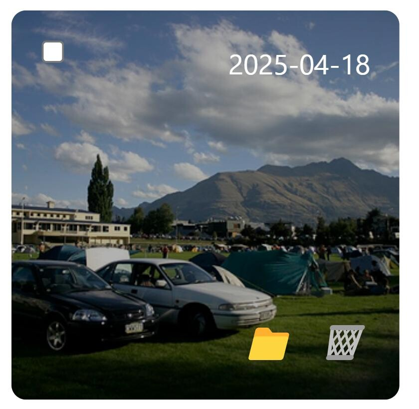</td>
    <td width="50%">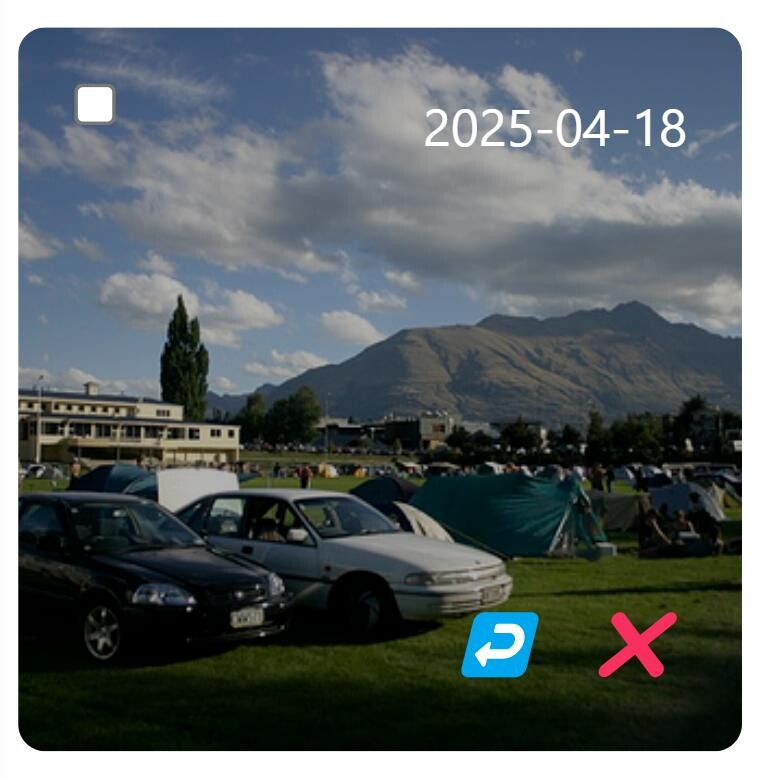</td>
  </tr>
  <tr>
    <td align="center"><sub>悬停图片：移动到图集 / 移入回收站</sub></td>
    <td align="center"><sub>回收站：恢复或永久删除</sub></td>
  </tr>
</table>

## 系统架构

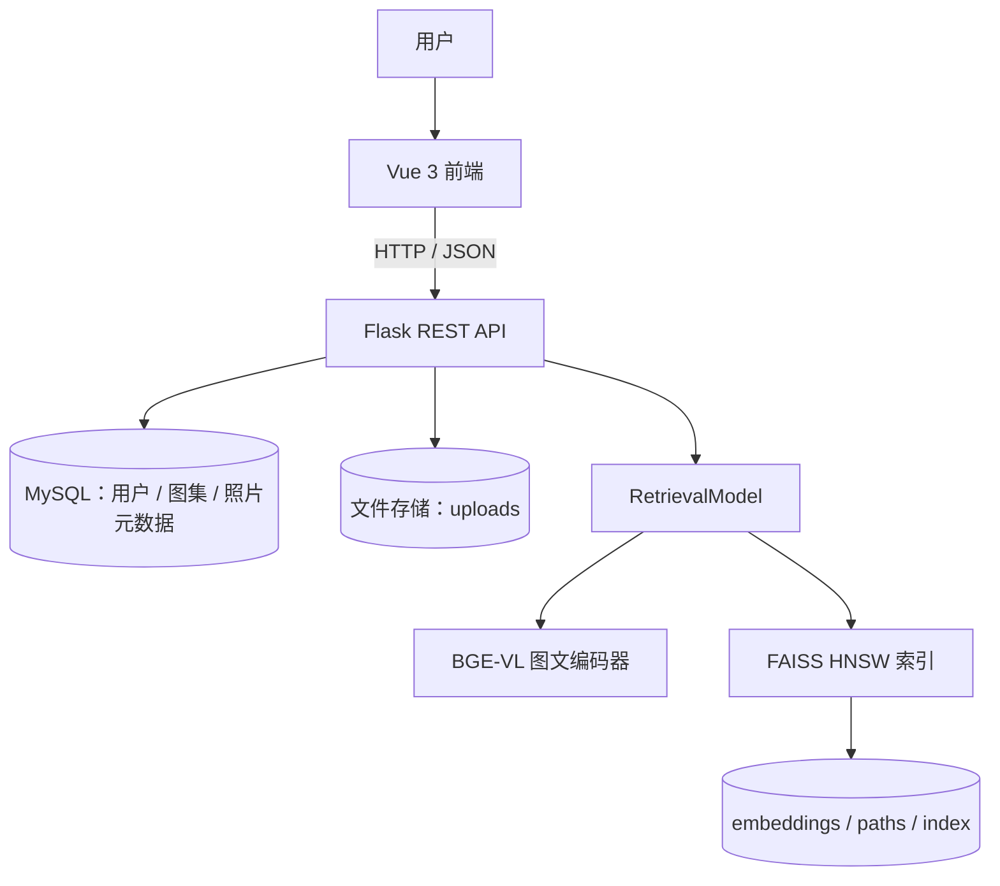

### 一次文本检索的调用链

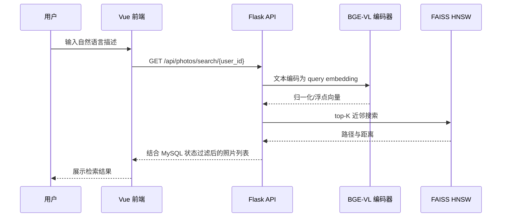

## 核心技术拆解

### 1. 图文统一编码

图片和文本分别输入 BGE-VL-base 的视觉/文本分支，映射到统一特征空间。上传图片时提取图像向量并写入用户索引；搜索时把查询文本编码成向量，在同一索引中进行近邻匹配。

代码入口：`intelligent_album/retrieval_model/retrieval.py`

```python
# 统一的图像 / 文本编码接口
feature = self.model.encode(images=image_path, text=text)

# 统一的近似最近邻索引
index = faiss.IndexHNSWFlat(dim, M=16)
index.hnsw.efConstruction = 200
index.hnsw.efSearch = 50
```

### 2. 三元量化 + 自蒸馏

项目将原始权重压缩为 `-1 / 0 / +1` 三个离散值，并保留缩放因子恢复输出量级；再用全精度教师模型约束量化学生模型的图像特征、文本特征和跨模态分布。

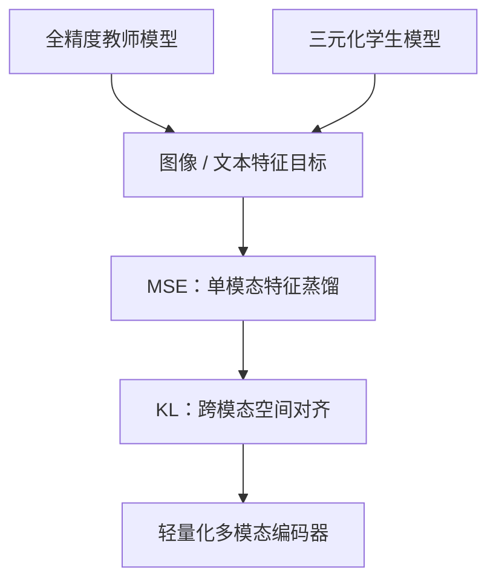

对应的工程关注点不是“压得越小越好”，而是根据部署资源选择不同模型档位：文本侧量化、视觉侧量化和全模态量化分别对应不同的精度—体积折中。

### 3. 每用户独立索引与增量更新

`RetrievalModel` 为每个 `user_id` 维护独立的数据结构：

```text
retrieval_model/utils/faiss_dependencies/{user_id}/
├── faiss_index.faiss        # HNSW 图索引
├── bgevl_embeddings.npy     # 图片 embedding
├── bgevl_image_paths.txt    # 向量到图片路径的映射
└── annotations.txt          # 可选文本标注
```

上传、删除和查询分别对应 `add_image`、`delete_image` 和 `query`，避免每次请求都从头扫描整库；MySQL 负责用户/图集/照片元数据，索引文件负责向量检索，两者通过图片相对路径关联。

## 实验结果：轻量化的真实取舍

实验在 CIRCO 上评估了不同模型档位。README 不只展示最好看的数字，也保留了压缩带来的精度下降，方便面试时解释工程权衡。

| 模型档位 | 体积 | 相对原模型压缩 | Recall@10 | mAP@5 | 适用定位 |
| --- | ---: | ---: | ---: | ---: | --- |
| 原始 BGE-VL | 570.90 MB | — | 58.50 | 33.56 | 精度优先 |
| 文本编码器三元化 | 436.04 MB | 23.62% | 53.00 | 27.51 | **更均衡的部署档位** |
| 图像编码器三元化 | 267.34 MB | 53.17% | 41.38 | 18.34 | 资源受限 |
| 全模态三元化 | 130.16 MB | 77.20% | 23.25 | 10.23 | 极限压缩 / 研究验证 |

<p align="center">
  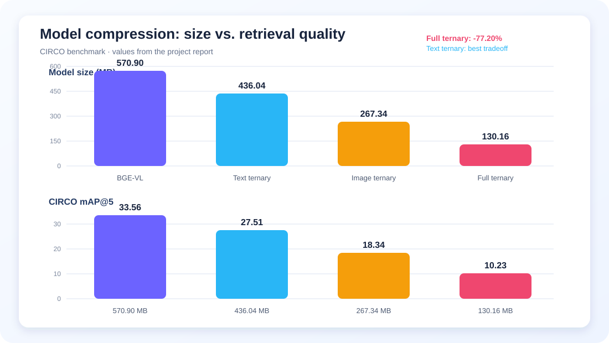
</p>

训练过程与原始测试报告中的图表如下：

<table>
  <tr>
    <td width="50%">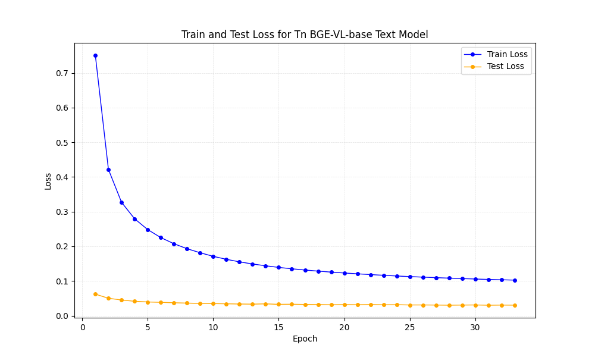</td>
    <td width="50%">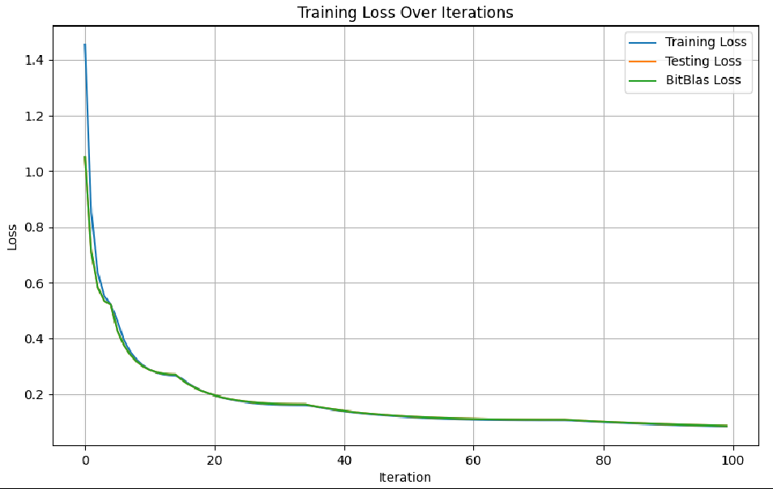</td>
  </tr>
  <tr>
    <td align="center"><sub>文本编码器训练损失</sub></td>
    <td align="center"><sub>图像编码器训练损失</sub></td>
  </tr>
</table>

<table>
  <tr>
    <td width="50%">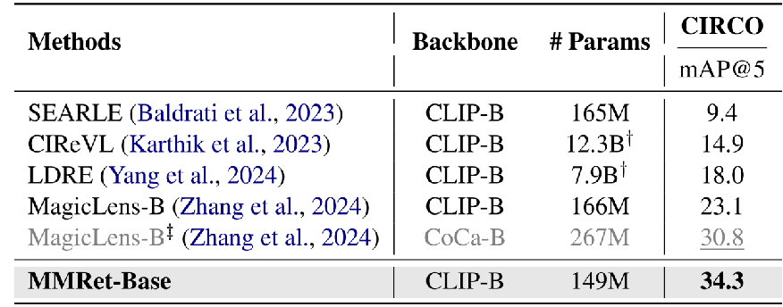</td>
    <td width="50%">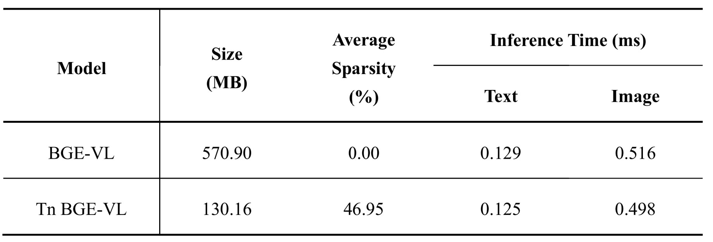</td>
  </tr>
  <tr>
    <td align="center"><sub>与代表性方法的 CIRCO mAP@5 对比</sub></td>
    <td align="center"><sub>模型体积、稀疏度与编码时延</sub></td>
  </tr>
</table>

## 功能与接口

| 模块 | 主要接口 | 说明 |
| --- | --- | --- |
| 用户 | `POST /api/users/register`<br />`POST /api/users/login` | 注册、登录 |
| 图片 | `POST /api/photos/upload`<br />`GET /api/photos/user/{user_id}` | 上传与浏览 |
| 语义检索 | `GET /api/photos/search/{user_id}?keyword=...` | 文本检索图片 |
| 图片状态 | `PUT /api/photos/{photo_id}/status`<br />`DELETE /api/photos/{photo_id}` | 回收站、恢复、删除 |
| 图集 | `/api/albums/*` | 创建、编辑、删除和查看图集 |

## 目录结构

```text
.
├── graph_client/                       # Vue 3 + Vite 前端
│   └── src/
│       ├── components/                 # 相册、图集、登录与移动端组件
│       └── composables/                # 用户与照片状态、API 调用
├── intelligent_album/                  # Flask 后端
│   ├── app.py                          # 服务入口（默认 5000）
│   ├── routes/                         # users / albums / photos API
│   ├── models/                         # 数据库模型
│   ├── config/database.py              # MySQL 初始化与查询封装
│   └── retrieval_model/                # BGE-VL、量化层、FAISS HNSW
├── docs/assets/                        # 项目截图、实验图与结果图
└── README.md
```

## 本地运行

> 仓库用于展示项目成果。模型权重和部分部署配置不随 Git 仓库提交；复现前需要准备对应的 BGE-VL 权重、MySQL 实例，以及与当前环境匹配的 PyTorch / Transformers / FAISS 依赖。

### 1. 启动后端

```bash
cd intelligent_album
python -m venv .venv
source .venv/bin/activate          # Windows: .venv\Scripts\activate
pip install -r requirements.txt

# retrieval_model 还需要与 CUDA/CPU 环境匹配的运行时依赖
pip install torch transformers faiss-cpu numpy opencv-python matplotlib requests
python app.py
```

后端默认监听 `http://127.0.0.1:5000`。运行前请在 `config/database.py` 配置本地 MySQL，并将数据库凭据放在环境变量或本地配置文件中，**不要把真实密码提交到 Git**。

### 2. 启动前端

```bash
cd graph_client
npm install
npm run start
```

前端默认监听 `http://127.0.0.1:3000`。当前前端代码中的 API 地址仍指向历史部署环境。若本地运行，请将 `src/composables/` 和相关组件中的 API base URL 改为自己的后端地址，或统一改成 Vite proxy 的相对路径 `/api`。

## 面试讲解主线

可以按下面 60 秒顺序介绍项目：

1. **问题**：相册规模变大后，文件名、时间和人工标签无法表达复杂语义，用户很难找到“某个场景里的某类照片”。
2. **方案**：用 BGE-VL 把图片和文本编码到同一空间，再用 FAISS HNSW 做近似近邻检索。
3. **难点**：原始多模态模型体积和推理成本较高，因此做三元量化与自蒸馏；模型精度、压缩率和部署延迟之间需要做可解释的档位选择。
4. **工程**：Vue 负责交互，Flask 负责 API 和模型编排，MySQL 保存业务元数据，用户级 HNSW 索引支持上传后的增量维护。
5. **结果**：在 CIRCO 上保留了原模型与三种压缩档位的对比；文本侧量化在体积、Recall 和 mAP 之间取得了更均衡的折中。

## 项目背景与贡献

- 项目性质：本科生大创项目的工程成果之一。
- 竞赛经历：参加第 18 届中国大学生计算机设计大赛（4C2025），作品编号 **2025019700**。
- 项目贡献：参与多模态检索模型训练与优化、三元量化/自蒸馏实验、CIRCO 评测和检索服务联调。
- 参赛文档：仓库中的 `docs/` 图片来自项目设计与开发文档，便于快速了解产品界面和实验结果。

## 后续可演进方向

- 将前端 API 地址、数据库连接和第三方翻译服务统一改为环境变量配置；
- 增加离线索引构建、批量导入和索引版本切换，支持百万级照片库；
- 使用稀疏矩阵乘法/硬件感知算子进一步兑现三元权重的加速潜力；
- 增加中文原生多模态查询、标签自动生成、相似照片去重和多用户共享。

## 说明

本项目目前未单独声明开源许可证。代码和截图主要用于课程/竞赛成果展示与技术交流，未经项目组许可请勿直接用于商业部署。
